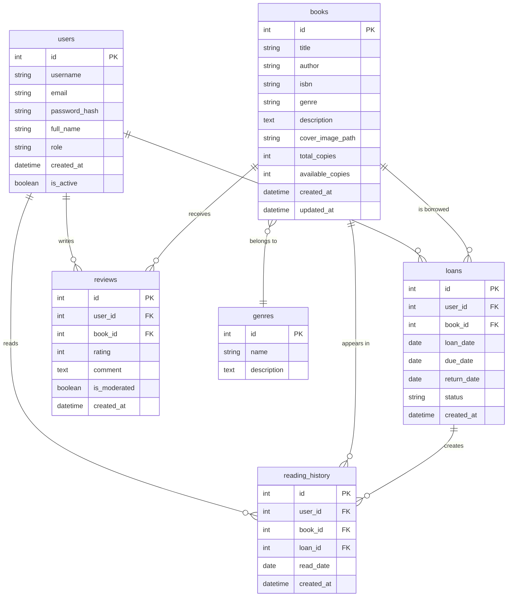

# Система управления библиотекой (LibraryFlow)

## 1. Общее описание
   LibraryFlow — это веб-приложение для управления библиотекой. Позволяет управлять каталогом книг, регистрировать читателей, отслеживать выдачу и возврат книг, а также управлять должниками. Система многопользовательская, с разделением ролей библиотекарей и читателей.

## 2. Цель проекта
Продемонстрировать навыки:
- Понимание принципов ООП и паттернов проектирования
- Работа с алгоритмами и структурами данных
- Java Core (коллекции, исключения, дженерики)
- Java EE (Servlets, JSP, JSTL, фильтры)
- Работа с реляционной БД (PostgreSQL 16)
- Проектирование REST API
- Использование Git для контроля версий
- Современный фронтенд на Svelte.js

## 3. Функциональные требования
### 3.1 Пользователи и аутентификация
- Регистрация нового пользователя (читатель/библиотекарь)
- Аутентификация через сессии (HttpSession)
- Две роли: LIBRARIAN, READER
- Хеширование паролей (BCrypt)
- Управление пользователями (только для LIBRARIAN)

### 3.2 Каталог книг
- CRUD-операции с книгами (только для LIBRARIAN)
- Поиск книг по названию, автору, ISBN, жанру
- Сортировка по различным полям
- Пагинация списка книг
- Отслеживание количества доступных экземпляров
- Загрузка обложек книг (локальное хранилище)
- Интеграция с OpenLibrary API для автозаполнения данных

### 3.3 Выдача и возврат книг
- Выдача книги читателю (LIBRARIAN)
- Возврат книги с проверкой срока
- Автоматический расчёт даты возврата
- Отслеживание просроченных книг
- Ограничение на количество книг у читателя (максимум 5)

### 3.4 Рейтинги и отзывы
- Оценка книги от 1 до 5 звёзд
- Написание текстовых отзывов
- Просмотр рейтинга и отзывов книги
- Средний рейтинг книги
- Модерация отзывов (LIBRARIAN)
- Возможность оставить отзыв только после прочтения

### 3.5 История чтения
- Автоматическое сохранение истории выдач
- Просмотр истории чтения пользователем
- Статистика по прочитанным книгам
- Любимые жанры и авторы

### 3.6 Отчёты и статистика
- Список должников с просроченными книгами
- Популярные книги (по количеству выдач и рейтингу)
- Активность читателей
- Статистика по жанрам
- Топ книг по рейтингу

## 4. Сущности и схема БД
### 4.1 Таблицы:
- users:
  - id
  - username
  - email
  - password_hash
  - full_name
  - role
  - created_at
  - is_active
- books:
  - id
  - title
  - author
  - isbn
  - genre
  - description
  - cover_image_path
  - total_copies
  - available_copies
  - created_at
  - updated_at

- loans:
  - id
  - user_id
  - book_id
  - loan_date
  - due_date
  - return_date
  - status
  - created_at

- reviews:
  - id
  - user_id
  - book_id
  - rating
  - comment
  - is_moderated
  - created_at

- reading_history:
  - id
  - user_id
  - book_id
  - loan_id
  - read_date
  - created_at

- genres:
  - id
  - name
  - description

### 4.2 Схема БД:


## 5. Технологический стек
### 5.1 Backend:
- Java 26
- Java EE (Servlets 4.0, JSP, JSTL)
- Maven для сборки
- PostgreSQL 16
- JDBC для работы с БД
- BCrypt для хеширования паролей
- Gson для JSON сериализации
- SLF4J + Logback для логирования

### 5.2 Frontend:
- Svelte.js (компонентный подход)
- Axios для HTTP-запросов
- Bootstrap 5 для стилизации
- Vite для сборки

### 5.3 Инструменты:
- Git для контроля версий
- Docker + docker-compose (опционально)
- JUnit 5 для тестирования
- Postman для тестирования API

## 6. Требования к API
### 6.1 REST API Endpoints:
- Версионирование (префикс /api/v1/)
- Валидация входных данных
- Обработка ошибок (глобальный ExceptionHandler)
- Пагинация через параметры page и size
- JSON формат для всех ответов

### 6.2 Основные endpoints:
- Аутентификация:
```text
POST   /api/v1/auth/register          - Регистрация
POST   /api/v1/auth/login             - Вход
POST   /api/v1/auth/logout            - Выход
```

- Книги:
```text
GET    /api/v1/books                  - Список книг (с пагинацией)
POST   /api/v1/books                  - Добавить книгу
GET    /api/v1/books/{id}             - Получить книгу
PUT    /api/v1/books/{id}             - Обновить книгу
DELETE /api/v1/books/{id}             - Удалить книгу
GET    /api/v1/books/search           - Поиск книг
POST   /api/v1/books/{id}/cover       - Загрузить обложку
POST   /api/v1/books/import-openlibrary - Импорт из OpenLibrary
```

- Выдачи:
```text
GET    /api/v1/loans                  - Список выдач
POST   /api/v1/loans                  - Выдать книгу
PUT    /api/v1/loans/{id}/return      - Вернуть книгу
GET    /api/v1/loans/overdue          - Просроченные книги
```

- Отзывы и рейтинги:
```text
GET    /api/v1/books/{id}/reviews     - Получить отзывы книги
POST   /api/v1/books/{id}/reviews     - Оставить отзыв
PUT    /api/v1/reviews/{id}/moderate  - Модерация отзыва
GET    /api/v1/books/top-rated        - Топ книг по рейтингу
```

- История чтения:
```text
GET    /api/v1/users/{id}/history     - История чтения пользователя
GET    /api/v1/users/{id}/statistics  - Статистика чтения
```

- Пользователи:
```text
GET    /api/v1/users                  - Список пользователей
GET    /api/v1/users/{id}/loans       - Выдачи пользователя
```

## 7. Нефункциональные требования
- Покрытие тестами ≥ 50%
- Логирование всех операций
- Конфигурация через properties-файлы
- Валидация на стороне сервера и клиента
- Защита от SQL-инъекций (PreparedStatement)
- Защита от XSS (экранирование)
- CSRF-защита для форм
- Сессии с тайм-аутом 30 минут
- Загрузка файлов до 5MB (обложки книг)

## 8. Интеграция с OpenLibrary API
### 8.1 Назначение
- Автозаполнение данных о книгах при добавлении
- Импорт тестовых данных для разработки
- Получение обложек книг
- Обогащение каталога метаданными

### 8.2 Логика импорта книг
- Импорт работает по принципу "поставки книг":
- Запрашивается случайная выборка книг из OpenLibrary
- Указывается количество книг для импорта
- Если книга уже существует в библиотеке — увеличивается количество копий
- Если книга новая — создаётся запись с одной копией
- При повторном импорте той же книги — total_copies и available_copies увеличиваются

### 8.4 API для импорта
- Запрос на импорт 50 случайных книг:
```json
{
    "genre": "science_fiction",
    "limit": 50
}
```
- Ответ:
```json
{
    "imported": 50,
    "new_books": 35,
    "existing_books": 15,
    "total_books_in_library": 120
}
```

## 9. Структура проекта
```txt
LibraryManagment/
├── backend/
│   ├── src/
│   │   ├── main/
│   │   │   ├── java/com/librarymanagment/
│   │   │   │   ├── config/          # Конфигурации
│   │   │   │   ├── controller/      # Сервлеты
│   │   │   │   ├── dao/             # Data Access Objects
│   │   │   │   ├── exception/       # Кастомные исключения
│   │   │   │   ├── filter/          # Фильтры (CORS, Auth)
│   │   │   │   ├── model/           # Сущности
│   │   │   │   ├── service/         # Бизнес-логика
│   │   │   │   ├── integration/     # OpenLibrary клиент
│   │   │   │   └── util/            # Утилиты
│   │   │   ├── resources/
│   │   │   │   ├── database.properties
│   │   │   │   └── logback.xml
│   │   │   └── webapp/
│   │   │       ├── WEB-INF/
│   │   │       │   └── web.xml
│   │   │       ├── uploads/         # Обложки книг
│   │   │       └── static/          # Svelte build
│   │   └── test/
│   │       └── java/com/librarymanagment/
│   └── pom.xml
│
├── frontend/
│   ├── src/
│   │   ├── lib/
│   │   │   ├── api/                 # API клиенты
│   │   │   ├── components/          # Svelte компоненты
│   │   │   └── stores/              # Svelte stores
│   │   ├── App.svelte
│   │   └── main.js
│   ├── package.json
│   └── vite.config.js
│
├── docker-compose.yaml
├── .gitignore
└── README.md
```

## 10. Docker-окружение
docker-compose.yaml включает:
- PostgreSQL 16 (порт 5432)
- Backend (Tomcat, порт 8081)
- Frontend dev server (порт 5173, только для разработки)

## 11. Проектирование базы данных

### 11.1 ACID
Проект использует **PostgreSQL** — реляционную СУБД, обеспечивающую ACID-транзакции:

| Свойство | Описание | Пример в проекте |
|----------|----------|------------------|
| **Atomicity** (Атомарность) | Транзакция выполняется целиком или не выполняется вообще | Выдача книги + уменьшение `available_copies` — в одной транзакции |
| **Consistency** (Согласованность) | Транзакция переводит БД из одного согласованного состояния в другое | Внешние ключи гарантируют, что выдача не может ссылаться на несуществующую книгу |
| **Isolation** (Изоляция) | Параллельные транзакции не мешают друг другу | Уровень изоляции PostgreSQL по умолчанию — `READ COMMITTED` |
| **Durability** (Долговечность) | Зафиксированные данные сохраняются даже при сбое | Все изменения записываются в `WAL` (`Write-Ahead Log`) |

### 11.2 Индексы
| Таблица           | Индекс | Тип | Обоснование |
|-------------------|--------|-----|-------------|
| `users`           | `username` (UNIQUE)| B-tree | Поиск при логине — частая операция |
| `users`           | `email` (UNIQUE) | B-tree | Поиск при логине и проверка уникальности |
| `books`           | `isbn` (UNIQUE) | B-tree | Проверка уникальности ISBN |
| `books`           | `author` | B-tree | Поиск книг по автору |
| `books`           | `genre` | B-tree | Фильтрация по жанру |
| `loans`           | `user_id` (FK) | B-tree (автоматически) | Получение выдач пользователя |
| `loans`           | `book_id` (FK) | B-tree (автоматически) | Проверка доступности книги |
| `loans`           | `status` | B-tree | Фильтрация активных выдач |
| `loans`           | `due_date` | B-tree | Поиск просроченных книг |
| `reviews`         | (`user_id`, `book_id`) (UNIQUE) | B-tree | Один отзыв на книгу от пользователя |
| `reviews`         | `book_id` | B-tree | Получение отзывов книги |
| `reviews`         | `rating` | B-tree | Сортировка по рейтингу |
| `reading_history` | `user_id` | B-tree | История чтения пользователя |
| `reading_history` | `book_id` | B-tree | Статистика по книге |